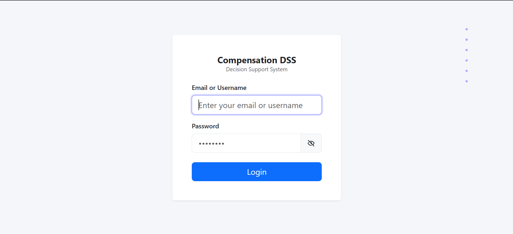
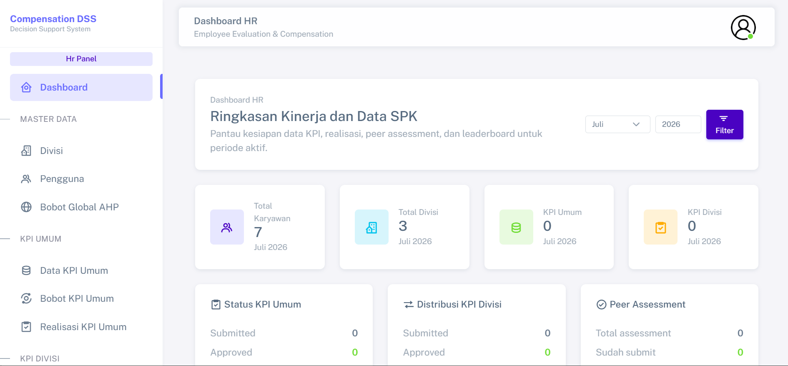
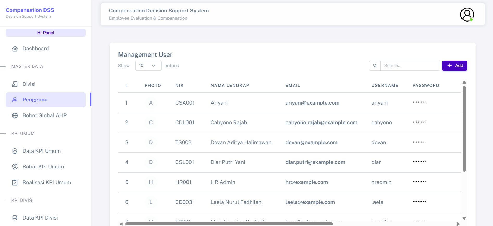
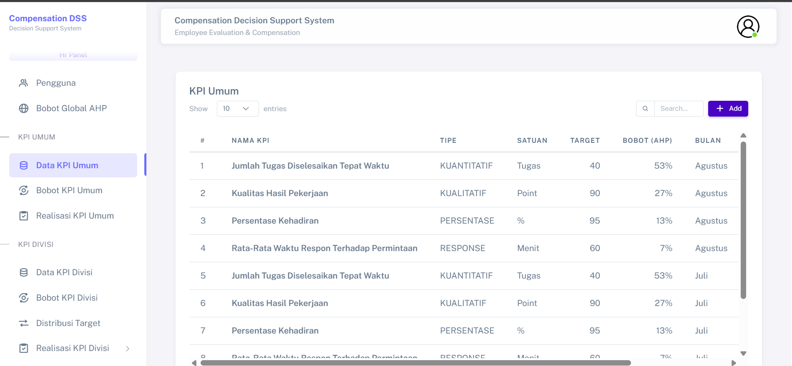
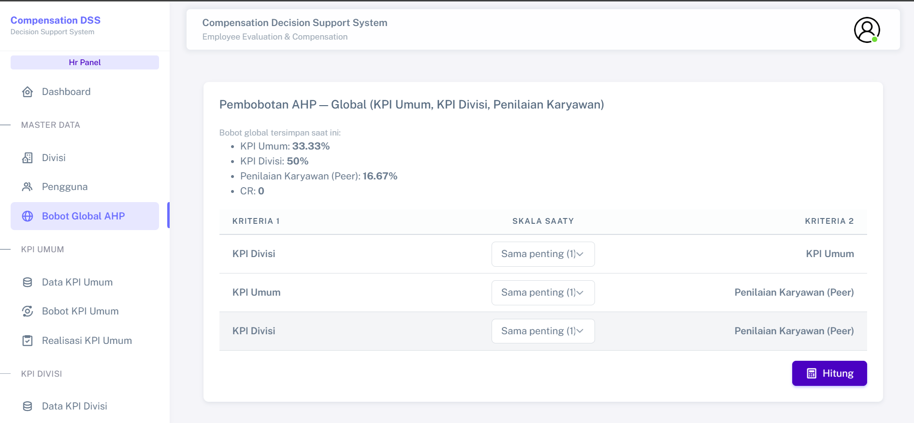
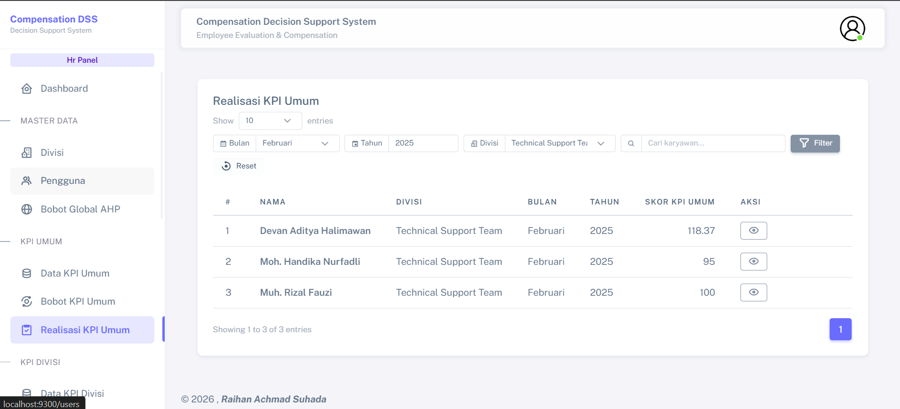
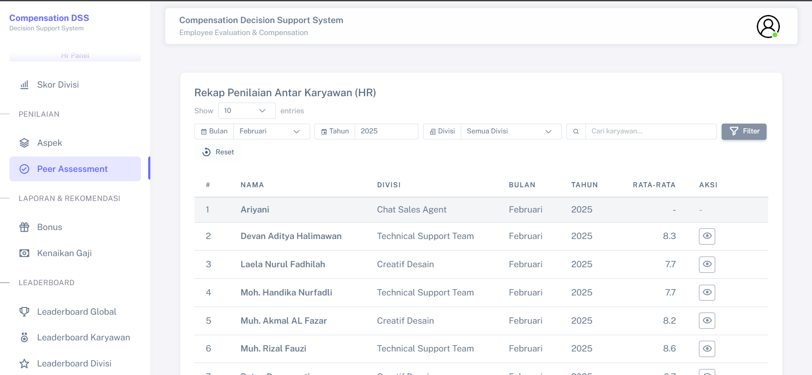
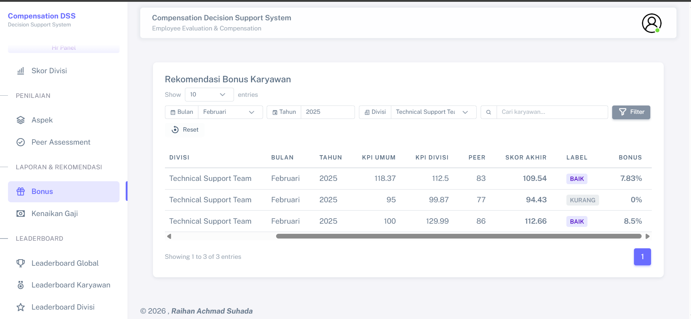

# Employee Compensation Decision Support System

Employee Compensation Decision Support System adalah aplikasi web untuk membantu proses evaluasi karyawan, pengelolaan KPI, pembobotan kriteria, realisasi KPI, peer assessment, leaderboard, serta rekomendasi kenaikan gaji dan bonus berbasis sistem pendukung keputusan.

Aplikasi ini dirancang untuk membantu proses evaluasi kompensasi karyawan agar data KPI, realisasi performa, penilaian antar karyawan, dan hasil rekomendasi dapat dikelola secara lebih terstruktur.

## Ringkasan Sistem

Sistem mendukung alur evaluasi karyawan dan penyusunan rekomendasi kompensasi berdasarkan tanggung jawab setiap role:

- HR mengelola data karyawan, divisi, KPI, AHP weighting, aspek penilaian, realisasi KPI, dan laporan rekomendasi.
- Leader mengelola atau meninjau realisasi KPI serta performa karyawan dalam divisinya.
- Employee dapat melihat KPI, mengisi peer assessment, dan melihat informasi performa sesuai akses.
- Owner / Management dapat memantau dashboard, leaderboard, serta hasil rekomendasi kenaikan gaji dan bonus.

Hasil rekomendasi merupakan informasi pendukung pengambilan keputusan dan tetap memerlukan peninjauan dari pihak manajemen yang berwenang.

## Developer Role

- Menganalisis workflow evaluasi karyawan, KPI, peer assessment, dan rekomendasi kompensasi.
- Merancang struktur data untuk user, role, divisi, KPI, AHP weighting, realisasi KPI, peer assessment, leaderboard, dan rekomendasi.
- Mengembangkan aplikasi web menggunakan Laravel, Blade, PostgreSQL, Vite, Tailwind CSS, Bootstrap, dan Sneat UI.
- Mengimplementasikan authentication dan role-based access untuk Owner / Management, HR, Leader, dan Employee.
- Mengembangkan fitur user management, division management, KPI management, AHP weighting, realisasi KPI, peer assessment, leaderboard, rekomendasi kenaikan gaji, rekomendasi bonus, dan reports.
- Menyiapkan akun demo, screenshot aplikasi, dan dokumentasi project.

## Tech Stack

### Backend

- Laravel 12
- PHP 8.2+
- PostgreSQL

### Frontend

- Blade Template Engine
- Vite
- JavaScript

### Styling

- Tailwind CSS
- Bootstrap
- Sneat UI Template

### Authentication

- Custom Role-Based Authentication

### Decision Support

- AHP-based Weighting
- KPI Evaluation
- Peer Assessment
- Compensation Recommendation

### Tools

- Composer
- NPM
- Git

## Fitur Utama

### Authentication & Role

- Authentication dan role-based access.
- Menu dan tindakan yang disesuaikan dengan tanggung jawab setiap role.
- Dashboard ringkasan evaluasi karyawan.

### Master Data

- Manajemen data user dan role.
- Manajemen divisi dan data karyawan.

### KPI Management & AHP Weighting

- Manajemen KPI umum dan KPI divisi.
- Pembobotan prioritas kriteria menggunakan AHP.

### KPI Realization & Peer Assessment

- Input dan validasi realisasi KPI karyawan.
- Peer assessment antar karyawan.
- Perhitungan nilai akhir evaluasi.

### Leaderboard, Recommendation & Reports

- Leaderboard performa karyawan dan divisi.
- Rekomendasi kenaikan gaji.
- Rekomendasi bonus karyawan.
- Laporan hasil rekomendasi.

## Role & Akses

Menu yang terlihat dan tindakan yang tersedia mengikuti tanggung jawab serta cakupan akses masing-masing role.

### Owner / Management

- Melihat dashboard dan ringkasan evaluasi organisasi.
- Memantau data karyawan, KPI, dan realisasi performa.
- Melihat leaderboard karyawan dan divisi.
- Meninjau rekomendasi kenaikan gaji dan bonus sebagai bahan pengambilan keputusan.

### HR

- Mengelola data user, karyawan, divisi, KPI, dan aspek penilaian.
- Menentukan bobot prioritas kriteria menggunakan AHP.
- Meninjau dan memvalidasi realisasi KPI.
- Memantau peer assessment dan proses evaluasi kompensasi.
- Meninjau laporan rekomendasi kenaikan gaji dan bonus.

### Leader

- Melihat data dan performa anggota divisi.
- Mendistribusikan target KPI divisi.
- Mengisi atau meninjau realisasi KPI anggota divisi.
- Memantau leaderboard dan rekomendasi sesuai cakupan akses.

### Employee

- Melihat KPI, realisasi, dan hasil evaluasi miliknya sesuai akses.
- Mengisi peer assessment antar karyawan.
- Melihat leaderboard serta informasi rekomendasi yang tersedia.

## Struktur Project

```text
employee-compensation-decision-support-system/
|-- app/
|-- database/
|-- public/
|-- resources/
|   `-- views/
|-- routes/
|-- docs/
|   `-- screenshots/
`-- README.md
```

## Screenshots

Screenshot berikut menunjukkan alur utama aplikasi, mulai dari authentication hingga hasil rekomendasi kompensasi.

### Login



### Dashboard



### User Management



### KPI Management



### AHP Weighting



### KPI Realization



### Peer Assessment



### Compensation Recommendation



## Persiapan Environment

Pastikan perangkat pengembangan telah memiliki:

- PHP 8.2+
- Composer
- Node.js
- npm
- PostgreSQL
- Git

## Installation

Clone repository dan masuk ke direktori project:

```bash
git clone https://github.com/raihanachmadsuhadadev/employee-compensation-decision-support-system.git
cd employee-compensation-decision-support-system
```

Install dependency backend dan frontend:

```bash
composer install
npm install
```

Salin file environment dan buat application key:

```bash
cp .env.example .env
php artisan key:generate
```

Pada Windows PowerShell, file environment dapat disalin dengan:

```powershell
Copy-Item .env.example .env
```

Sesuaikan koneksi database, lalu jalankan migration dan seeder:

```bash
php artisan migrate:fresh --seed
```

Jalankan Laravel development server:

```bash
php artisan serve --host=127.0.0.1 --port=8000
```

Jalankan Vite pada terminal terpisah:

```bash
npm run dev
```

Aplikasi dapat diakses melalui `http://127.0.0.1:8000`.

## Environment Example

Contoh konfigurasi utama pada file `.env`:

```env
APP_NAME="Employee Compensation Decision Support System"
APP_URL=http://127.0.0.1:8000

DB_CONNECTION=pgsql
DB_HOST=127.0.0.1
DB_PORT=5432
DB_DATABASE=employee_compensation_decision_support
DB_USERNAME=postgres
DB_PASSWORD=your_password
```

## Akun Demo

Seeder menyediakan akun berikut untuk mencoba akses setiap role. Seluruh akun menggunakan password `password`.

| Role | Username |
| --- | --- |
| Owner / Management | `owner` |
| HR | `hradmin` |
| Leader - Technical Support | `saepul` |
| Leader - Chat Sales | `diar` |
| Leader - Creative Design | `cahyono` |
| Employee | `handika`, `devan`, `rizal`, `ariyani`, `akmal`, `ratna`, `laela` |

## Alur Penggunaan Sistem

1. HR mengelola data user, role, divisi, karyawan, KPI, dan aspek penilaian.
2. HR mengatur bobot prioritas kriteria menggunakan AHP.
3. Leader atau HR mengelola target dan realisasi KPI sesuai cakupan akses.
4. Employee mengisi peer assessment sesuai periode penilaian.
5. Sistem menghitung nilai evaluasi berdasarkan KPI, bobot kriteria, realisasi performa, dan peer assessment.
6. Sistem menampilkan leaderboard performa karyawan dan divisi.
7. Sistem menghasilkan rekomendasi kenaikan gaji dan bonus.
8. Owner / Management dan HR meninjau hasil rekomendasi sebagai bahan pendukung keputusan.

## Decision Support Method

Sistem menggabungkan beberapa komponen evaluasi untuk menghasilkan informasi pendukung keputusan kompensasi:

- KPI digunakan sebagai indikator utama evaluasi performa.
- AHP digunakan untuk menentukan bobot prioritas kriteria.
- Realisasi KPI digunakan untuk menghitung tingkat pencapaian karyawan.
- Peer assessment memberikan perspektif tambahan dalam proses penilaian.
- Nilai akhir digunakan untuk mendukung rekomendasi kenaikan gaji dan bonus.

Hasil rekomendasi merupakan informasi pendukung dan tetap memerlukan peninjauan dari pihak manajemen yang berwenang. Sistem tidak menggantikan keputusan akhir organisasi.

## Validasi Build

Bersihkan cache aplikasi dan periksa daftar route Laravel:

```bash
php artisan optimize:clear
php artisan route:list
```

Validasi production build frontend:

```bash
npm run build
```

## Project Status

Aplikasi telah diselesaikan sebagai sistem pendukung keputusan kompensasi karyawan berbasis web. Sistem mencakup manajemen KPI, AHP weighting, realisasi KPI, peer assessment, leaderboard, rekomendasi kenaikan gaji, rekomendasi bonus, dan laporan.

Pengembangan dapat dilanjutkan dengan automated testing, validasi yang lebih kuat, audit log, laporan lanjutan, fitur export, konfigurasi deployment, dan penyempurnaan UI/UX.


