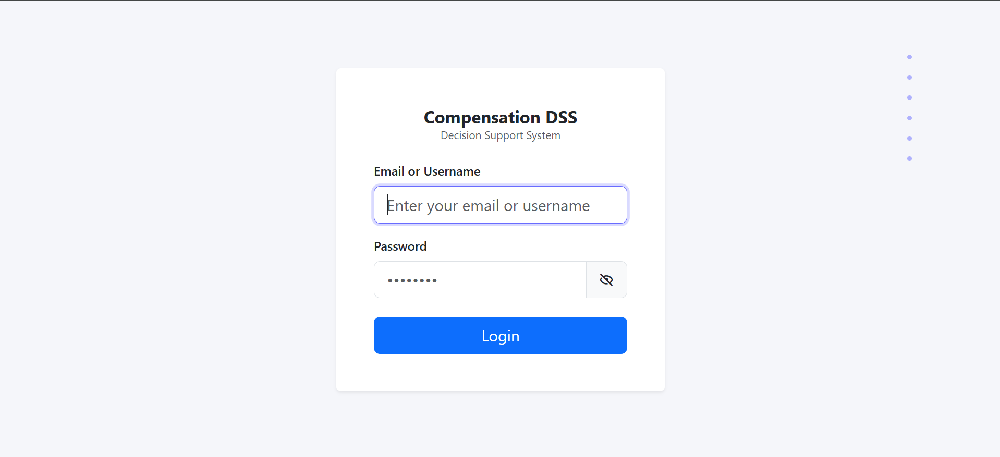
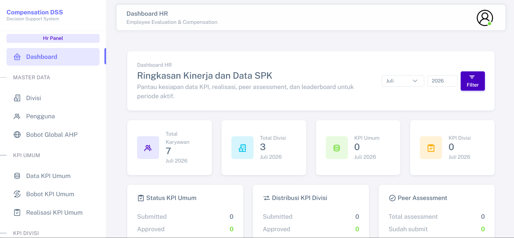
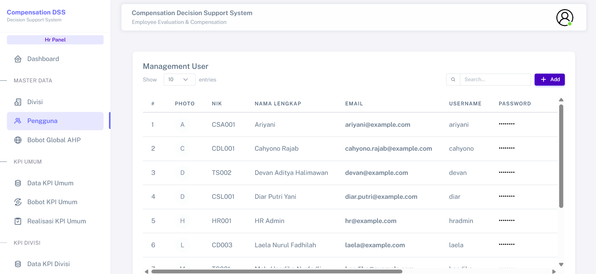
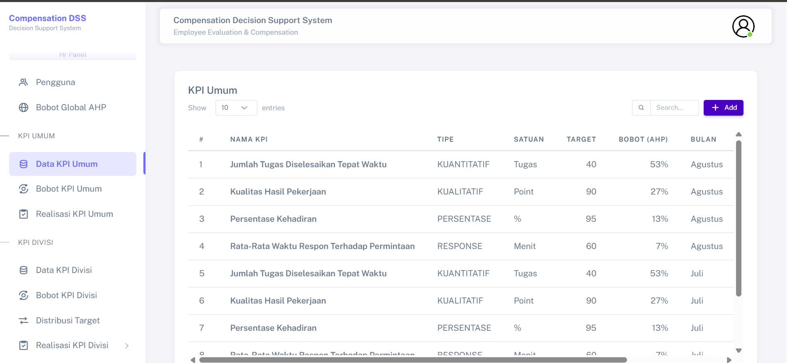
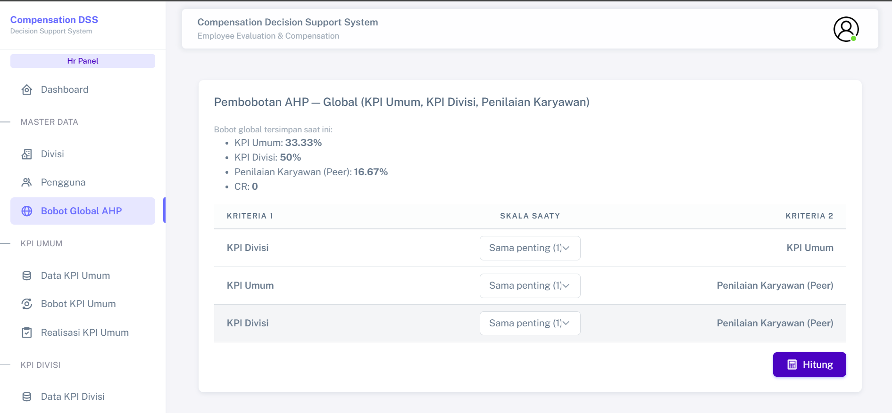
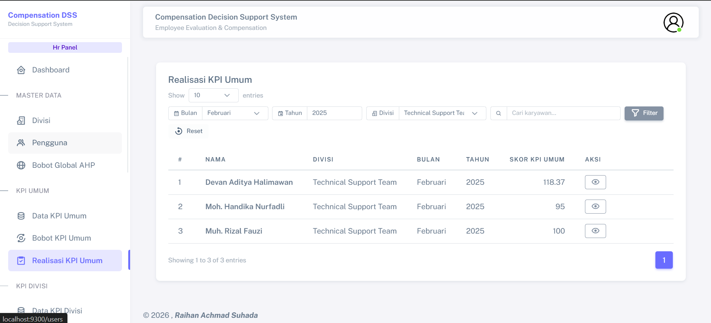
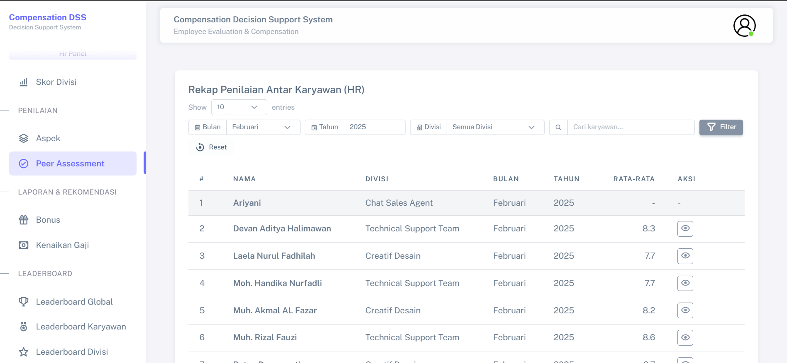
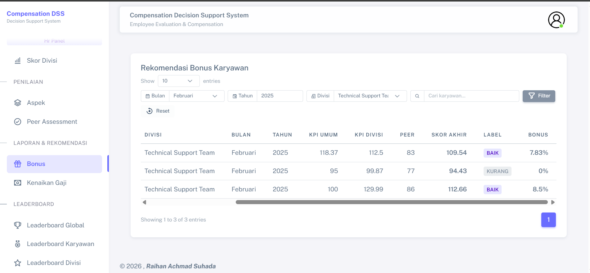

# Employee Compensation Decision Support System

Employee Compensation Decision Support System is a web-based decision support application designed to support employee evaluation, KPI management, criteria weighting, KPI realization, peer assessment, performance leaderboard, salary increase recommendation, and bonus recommendation.

The system helps organize compensation evaluation data so that employee performance, KPI realization, peer assessment results, and recommendation outputs can be managed in a more structured and transparent way.

## System Overview

This application supports the employee evaluation and compensation recommendation workflow based on several user roles:

* HR manages employee data, divisions, KPI data, AHP weighting, assessment aspects, KPI realization, and recommendation reports.
* Leaders manage or review KPI realization and employee performance within their division.
* Employees can view KPI information, submit peer assessments, and access their own performance information based on their permissions.
* Owner / Management can monitor dashboards, leaderboards, salary increase recommendations, and bonus recommendations.

The recommendation results are intended to support decision-making and still require final review by authorized management.

## Developer Role

The development responsibilities in this project included:

* Analyzing employee evaluation workflows, KPI management, peer assessment, and compensation recommendation processes.
* Designing the data structure for users, roles, divisions, KPIs, AHP weighting, KPI realization, peer assessment, leaderboards, and recommendations.
* Developing the web application using Laravel, Blade, PostgreSQL, Vite, Tailwind CSS, Bootstrap, and Sneat UI.
* Implementing authentication and role-based access for Owner / Management, HR, Leader, and Employee.
* Developing user management, division management, KPI management, AHP weighting, KPI realization, peer assessment, leaderboard, salary increase recommendation, bonus recommendation, and reporting features.
* Preparing demo accounts, application screenshots, and project documentation.

## Tech Stack

### Backend

* Laravel 12
* PHP 8.2+
* PostgreSQL

### Frontend

* Blade Template Engine
* Vite
* JavaScript

### Styling

* Tailwind CSS
* Bootstrap
* Sneat UI Template

### Authentication

* Custom Role-Based Authentication

### Decision Support

* AHP-Based Weighting
* KPI Evaluation
* Peer Assessment
* Compensation Recommendation

### Tools

* Composer
* NPM
* Git

## Main Features

### Authentication & Role Access

* User authentication.
* Role-based access control.
* Menus and actions adjusted according to each role.
* Evaluation dashboard summary.

### Master Data

* User and role management.
* Division management.
* Employee data management.

### KPI Management & AHP Weighting

* General KPI management.
* Division KPI management.
* Criteria priority weighting using the AHP method.

### KPI Realization & Peer Assessment

* Employee KPI realization input.
* KPI realization validation.
* Peer assessment between employees.
* Final evaluation score calculation.

### Leaderboard, Recommendation & Reports

* Employee and division performance leaderboard.
* Salary increase recommendation.
* Employee bonus recommendation.
* Recommendation result reports.

## Roles & Access

Visible menus and available actions follow each role’s responsibility and access scope.

### Owner / Management

* View organizational evaluation dashboard and summaries.
* Monitor employee data, KPI data, and performance realization.
* View employee and division leaderboards.
* Review salary increase and bonus recommendations as decision-support information.

### HR

* Manage users, employees, divisions, KPIs, and assessment aspects.
* Define criteria priority weights using AHP.
* Review and validate KPI realization.
* Monitor peer assessments and compensation evaluation processes.
* Review salary increase and bonus recommendation reports.

### Leader

* View division member data and performance.
* Distribute division KPI targets.
* Input or review KPI realization for division members.
* Monitor leaderboards and recommendations within the allowed access scope.

### Employee

* View assigned KPIs, realization data, and evaluation results based on access.
* Submit peer assessments.
* View available leaderboard and recommendation information.

## Project Structure

```text
employee-compensation-decision-support-system/
|-- app/
|-- database/
|-- public/
|-- resources/
|   `-- views/
|-- routes/
|-- docs/
|   `-- screenshots/
`-- README.md
```

## Screenshots

The following screenshots show the main application workflow from authentication to compensation recommendation results.

### Login



### Dashboard



### User Management



### KPI Management



### AHP Weighting



### KPI Realization



### Peer Assessment



### Compensation Recommendation



## Requirements

Make sure the local development environment has:

* PHP 8.2+
* Composer
* Node.js
* npm
* PostgreSQL
* Git

## Installation

Clone the repository and enter the project directory:

```bash
git clone https://github.com/raihanachmadsuhadadev/employee-compensation-decision-support-system.git
cd employee-compensation-decision-support-system
```

Install backend and frontend dependencies:

```bash
composer install
npm install
```

Copy the environment file:

```bash
cp .env.example .env
```

For Windows PowerShell:

```powershell
Copy-Item .env.example .env
```

Generate the application key:

```bash
php artisan key:generate
```

Configure the PostgreSQL database connection in `.env`, then run migrations and seeders:

```bash
php artisan migrate --seed
```

Run the development servers:

```bash
php artisan serve
npm run dev
```

Open the application in the browser:

```text
http://127.0.0.1:8000
```

## Demo Accounts

Demo accounts are intended only for local testing and demonstration.

If the project includes seeded demo users, check the database seeder or project documentation for available credentials.

## Project Status

**Completed**

The core features for role-based access, KPI management, AHP weighting, KPI realization, peer assessment, leaderboard, salary increase recommendation, bonus recommendation, reporting, screenshots, and documentation have been completed.

## Project Scope

This project focuses on a web-based employee compensation decision support system.

The system is not intended to fully replace management decision-making. Recommendation results should be reviewed by authorized stakeholders before being used for real compensation decisions.

## Purpose

This project was developed as a portfolio project to demonstrate skills in Laravel web development, database design, role-based system development, KPI workflow implementation, decision-support logic, and project documentation.
